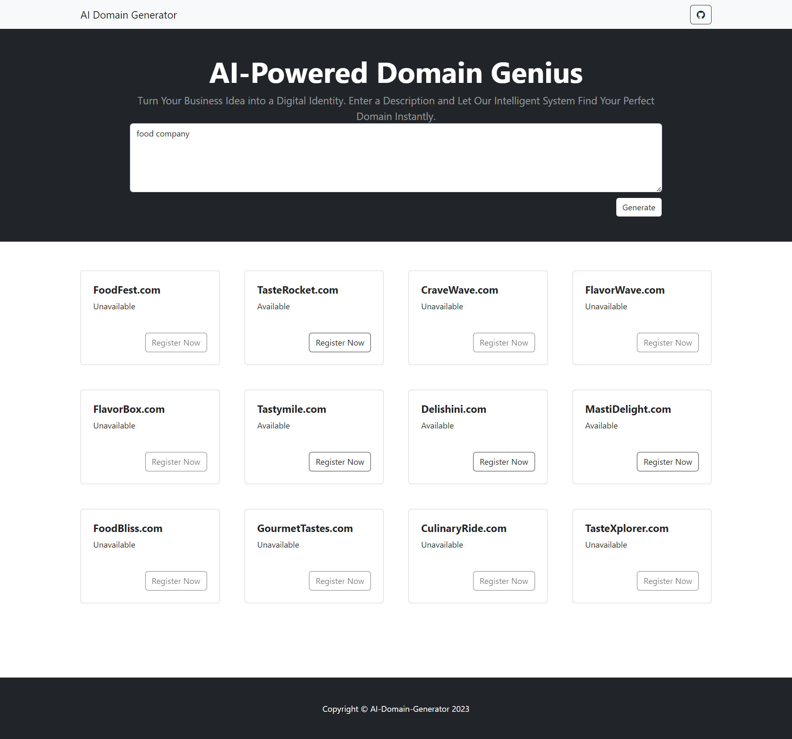

# AI Domain Generator
Using OpenAI API, generate creative domain names according to your input business description. Also shows the domain availability status using Whoisxml API.

# Home Page ScreenShot
 

# Script Installation
- After downloading or cloning the repo, run
```
composer install
```
- copy .env.example into .env
- put the credentials in .env
- run index.php on the browser
